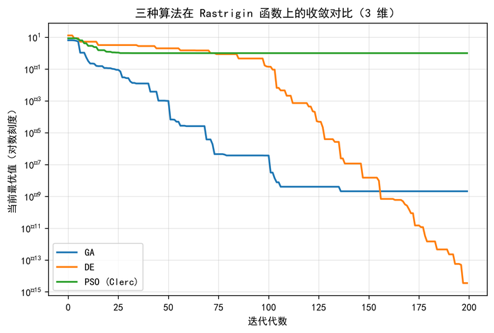
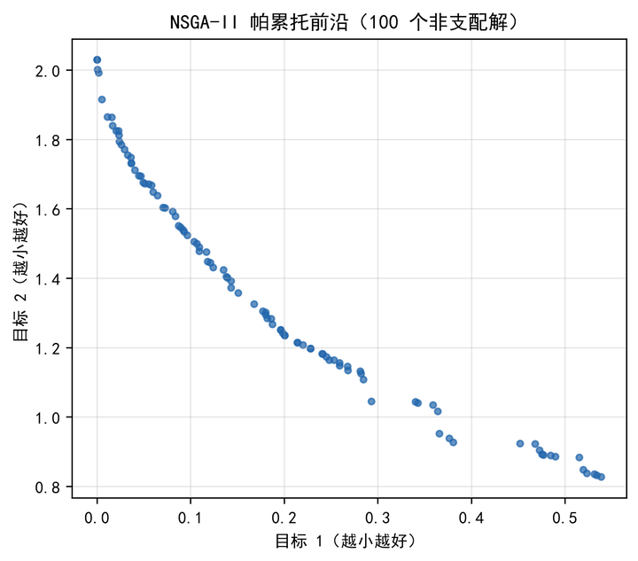
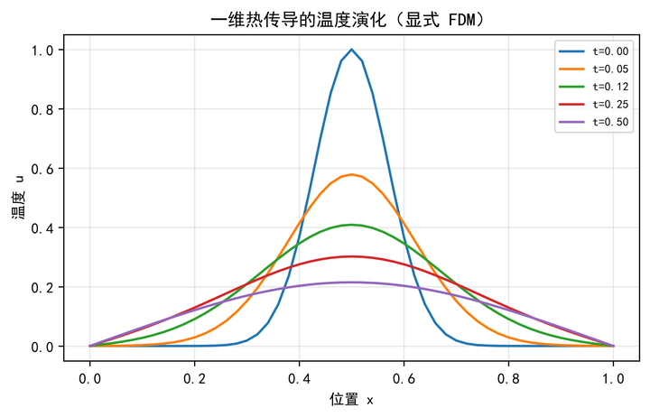

<div align="center">

# cumcm-coach

**全国大学生数学建模竞赛（CUMCM）建模与论文辅助工具**

题型识别与模板路由 + 交卷前自动化检查，帮你把时间花在真正的建模上。

[](https://github.com/tianguangpu/cumcm-coach/stargazers)
[](LICENSE)
[](https://github.com/tianguangpu/cumcm-coach/actions/workflows/ci.yml)
[](pyproject.toml)
[](tests/)

[中文](README.md) · [English](README.en.md) · [快速开始](#快速开始) · [架构](#架构设计) · [贡献指南](CONTRIBUTING.md)

</div>

---

## 30 秒：要不要用？

**你做 CUMCM，72 小时最怕两件事**：拿到题不知道该用啥方法；交卷前踩硬伤（页数超限、缺 AI 声明、数值对不上）。

**这工具就解决这两件**：题型识别帮你选对方法（A机理 / B优化 / C评价 / D数据），L1 自动化检查帮你交卷前查硬伤。

```bash
git clone https://github.com/tianguangpu/cumcm-coach.git && cd cumcm-coach
pip install -e .
python examples/01_optimization.py    # 先跑一个示例看看效果
```

> 想深入了解 → [新手最小路径](docs/00_新手最小路径.md)（3 页）→ [5 分钟跑通](#5-分钟跑通) → [完整 SOP](#完整比赛流程国赛-sop)。

---

## 这是什么

一个面向 CUMCM 国赛的**全流程论文生成工具链**，以 [Claude Code](https://claude.com/claude-code) Skill 的形式分发。

它解决的问题是：**数学建模竞赛的时间有 72 小时，但真正决定成绩的是「模型有没有创新、验证够不够硬、论文有没有硬伤」这三件事** —— 而这三件事恰恰最容易在赶工中被牺牲。

本工具把评审老师真正会看的点，固化成**可自动检查的流程**：每个子问题必须走完六段子结构、每张图必须带结论、每个数值必须可溯源、每处创新必须配消融对照。

**示例能生成这样的图**（来自 `examples/`，跑一遍就有）：

<div align="center">
  
  
  
</div>

### 为什么选它

| 你需要的 | 手写 + scipy | 其他 AI 建模工具 | cumcm-coach |
|---------|-------------|-----------------|-------------|
| 拿到题选对方法 | 靠自己查资料 | 部分覆盖 | ✅ 题型识别 → 模板/算法路由 |
| 交卷前查硬伤 | 容易漏 | 部分 | ✅ L1 检查（页数 / AI 声明 / 数值溯源）|
| 反假图溯源 | 无 | 无 | ✅ 图 ↔ 脚本 ↔ 数据五层溯源 |
| 上手成本 | 低 | 高（要学全套）| 低（新手只看 3 页）|

### 设计原则

| 原则 | 具体做法 |
|------|---------|
| **不编数字** | 提供 `result_registry.py` 数值溯源注册表，帮你追踪数值来源——但这是**辅助工具、靠自觉遵守**，无法强制 |
| **不自我循环** | 模型必须与**强基线**对比（而非弱贪心），避免「自己证明自己好」 |
| **不裸画图** | 每张图至少叠加 1 项可视化技法，禁止裸 `plot` / `bar` |
| **不藏短板** | 假设误差逐项量化，灵敏度分析必须报出敏感参数，不粉饰 |
| **合规优先** | 2024 年起国赛要求 AI 工具使用声明，全链路自动记录 AI 交互并生成合规材料 |

---

## 核心能力

<table>
<tr><td width="50%" valign="top">

**🎯 题型自适应**

自动识别 A 机理 / B 优化 / C 评价 / D 数据 四大题型，路由到对应论文模板与算法族；再细分为 12 个细类（OPT/EVA/PRE/GRA/PDE/STA/CLU/GAM/ECO/PHY/NLP/COM）决定算法选型。

**🔬 36 个算法模块**

覆盖优化、预测、评价、图论、机理、统计、博弈、生态、验证九大方向，全部可直接 `import`，不依赖外部服务。

**⚙️ 多求解器自动路由**

LP → HiGHS ｜ MIP/CSP → OR-Tools CP-SAT ｜ NLP → SciPy ｜ 连续优化 → 内置 SA-PSO / GA / DE。

</td><td width="50%" valign="top">

**✅ 四重检验强制**

拟合精度 + Sobol 全局灵敏度 + 蒙特卡洛（≥200 次）+ 假设误差量化（≥3 项），缺一项即降档。

**📊 出版级图表**

300dpi PNG + 600dpi 矢量 PDF 双导出，5 套学术色板（Nature/Science/Qualitative/Diverging/IEEE），10 项可视化技法。

**⚖️ L1–L4 四级评审**

自动化检查 → 交叉验证 → 对抗评审 → Red-Team 终审，含页数合规、AI 声明位置、AIGC 风险自检。

</td></tr>
</table>

---

## 快速开始

### 环境要求

| 依赖 | 版本 | 必需性 |
|------|------|--------|
| Python | 3.10+ | **必需** |
| LaTeX (XeLaTeX + biber) | TeX Live / MiKTeX | 二选一 |
| Typst | 0.11+ | 二选一 |
| MATLAB | R2024a+ | 可选（惊艳图表） |

### 安装

```bash
# 克隆
git clone https://github.com/tianguangpu/cumcm-coach.git
cd cumcm-coach

# 核心依赖（必需）
pip install -e .

# 全部可选功能（求解器 + 灵敏度 + 图表样式 + 文献检索）
pip install -e ".[full]"

# 开发环境（测试 + 代码质量工具）
pip install -e ".[dev]"
```

### 5 分钟跑通

```bash
# 1. 初始化项目（生成目录结构与状态文件）
python scripts/init_project.py --team "202600001" --members "张三,李四,王五" --type B

# 2. 干跑全链流水线（不执行求解，验证流程连通性）
python scripts/run_all.py --dry

# 3. 运行测试
pytest tests/ -q

# 4. 查看可用命令
make help
```

### 完整比赛流程（国赛 SOP）

拿到赛题后，按下面 10 步走完「建模 → 求解 → 论文 → 交卷」全流程。✅ 是自动步骤，👤 是 Agent（你或 Claude）按 `SKILL.md` 执行的步骤：

| # | 步骤 | 关键命令 / 产物 | 自动 |
|---|------|----------------|------|
| 0 | 初始化项目 | `init_project.py --team "202600001" --members "张三,李四,王五" --type B` → `plan.md`/`todo.md` | ✅ |
| 1 | 问题分析 | `algorithms/misc/problem_analyzer.py` → 歧义/隐含约束/依赖图 | ✅ |
| 2 | 题型识别 + 创新方向 | `innovation_guide.py B reports/innovation_plan.json` | ✅ |
| 3 | 建模与求解 | 写 `code/*.py` → `results/*.json`（四问） | 👤 |
| 4 | 求解自证（反自证循环） | `self_verify.py --type B --results results/` | ✅ |
| 5 | 图表生成 | 数据图 + 技术路线图 → `figures/{png,pdf}/` | 👤 |
| 6 | 反假图溯源 | `check_verifiability.py --dir . --no-e2e`（图↔脚本↔数据五层） | ✅ |
| 7 | 论文撰写 | 套 `templates/template-b.tex` → `paper/main.tex`（六段子结构 + 四重检验） | 👤 |
| 8 | L1-L4 评审 | `auto_check.py --paper paper/main.tex --level all` + `semantic_anchor.py --problem problem.txt ...` | ✅ |
| 9 | AI 合规材料 | `ai_compliance.py all` → 声明 + 支撑材料 | ✅ |

一键串联所有 ✅ 自动步骤：

```bash
python scripts/run_all.py --team "202600001" --members "张三,李四,王五" --type B
# 断点续跑：python scripts/run_all.py --from 07
```

> **真实案例**：本仓库用 2026 E 题（SEM 广告投放）完整验证了这条 SOP——四问求解 → 论文 66 页 → L1-L4 评审通过（L4 语义锚点 86.1 分）。详见 `references/` 与 `tests/test_e2e.py`。

### 作为 Claude Code Skill 使用

本仓库同时是一个 Claude Code Skill。克隆到 skills 目录即可通过 `/cumcm-coach-skill-v7` 调用：

```bash
git clone https://github.com/tianguangpu/cumcm-coach.git \
  ~/.claude/skills/cumcm-coach-skill-v7
```

---

## 架构设计

### 流水线

```
赛题输入
   │
   ├─▶ ① 问题分析 ── 歧义检测 / 隐含约束挖掘 / 子问题依赖图
   │       └─▶ 需人工确认关键歧义
   │
   ├─▶ ② 题型识别 ── A机理 / B优化 / C评价 / D数据
   │       └─▶ 创新方向规划（5 类框架 + 强基线建议）
   │
   ├─▶ ③ 建模求解 ── 算法选型 → 求解器路由 → 结果自证 → 四重检验
   │       └─▶ 产物：code/ + results/ + ANALYSIS_MODELING_REPORT.md
   │
   ├─▶ ④ 图表生成 ── 常规图 / 惊艳图 / 流程图 三轨分工
   │       └─▶ 产物：figures/{png,pdf}/ + RESULTS_REPORT.md
   │
   ├─▶ ⑤ 论文撰写 ── LaTeX 或 Typst，金标准内核
   │       └─▶ 产物：paper/main.{tex,typ} + sections/
   │
   └─▶ ⑥ 四级评审 ── L1 自动 → L2 交叉 → L3 对抗 → L4 Red-Team
           └─▶ 产物：VERIFY_REPORT.md，任一 FAIL 回炉
```

### 目录结构

```
cumcm-coach/
├── SKILL.md                  # Skill 定义（完整流程规范）
├── README.md / README.en.md  # 中英文说明
├── QUICKSTART.md             # 快速上手
├── CHANGELOG.md              # 版本历史
├── CONTRIBUTING.md           # 贡献指南
│
├── algorithms/               # 算法库（36 模块，9 个方向）
│   ├── optimization/         #   优化：GA / DE / SA-PSO / AHO / PSO变体 / VRP / JobShop
│   ├── prediction/           #   预测：TAM / ARIMA / MLP / GM(1,1)
│   ├── evaluation/           #   评价：AHP+熵权+TOPSIS / VIKOR / GRA
│   ├── mechanistic/          #   机理：FDM 1D/2D / FEM / ODE
│   ├── validation/           #   验证：Sobol / 蒙特卡洛 / 假设误差 / SHAP
│   ├── network/              #   图论：Dijkstra / Kruskal / 最大流
│   ├── stats/                #   统计：t / ANOVA / 卡方 / 非参数检验
│   ├── game/                 #   博弈：纯策略与混合策略纳什均衡
│   ├── ecology/              #   生态：Lotka-Volterra / SIR / SEIR
│   └── misc/                 #   元工具：问题分析 / 创新引导
│
├── scripts/                  # 工具脚本（30 个）
│   ├── run_all.py            #   全链流水线（支持 --from 断点续跑）
│   ├── init_project.py       #   项目初始化
│   ├── solver_router.py      #   多求解器自动路由
│   ├── auto_check.py         #   L1–L4 四级评审
│   ├── result_registry.py    #   数值溯源注册表
│   ├── baseline_compare.py   #   强基线对比
│   ├── ai_compliance.py      #   AI 合规材料生成
│   └── ...
│
├── templates/                # 论文模板（4 题型 × LaTeX/Typst）
├── references/               # 参考文档（20 篇规范与手册）
│   └── playbooks/            #   5 本解题手册
├── vault/                    # Obsidian 知识库（可独立浏览）
├── tests/                    # 测试套件
└── state/                    # 运行状态与决策日志
```

---

## 使用示例

> 四个可直接运行的完整示例见 [`examples/`](examples/)：
> 优化算法对比（B 题）、综合评价（C 题）、时序预测（D 题）、四重检验（通用）。

### 示例 1：优化算法求解

```python
from algorithms.optimization.ga import GA

result = GA(
    objective=lambda x: sum(xi**2 for xi in x),
    dim=3,
    bounds=[(-5, 5)] * 3,
    pop_size=50,
    max_gen=200,
)
print(f"最优解 {result['x_opt']}  最优值 {result['f_opt']}")
```

### 示例 2：综合评价

```python
from algorithms.evaluation.ahp_entropy_topsis import ComprehensiveEvaluation

data = [[7, 9, 9], [8, 6, 8], [9, 4, 7]]
ev = ComprehensiveEvaluation(data, benefit_cols=[0, 1, 2], cost_cols=[])
weights = ev.run_entropy()      # 熵权法客观赋权
ranking = ev.topsis()           # TOPSIS 排序
```

### 示例 3：求解器自动路由

```python
from scripts.solver_router import SolverRouter

router = SolverRouter()
result = router.solve({
    "type": "vrp",
    "dist": distance_matrix,
    "demands": demands,
    "capacity": 100,
    "n_vehicles": 5,
})
```

### 示例 4：数值溯源（防编造）

```bash
# 注册数值 → 标记验证状态 → 校验论文引用
python scripts/result_registry.py init
python scripts/result_registry.py add --id r1 --value 123.45 --status PASS
python scripts/result_registry.py verify
```

### 示例 5：四级评审

```bash
python scripts/auto_check.py --paper paper/main.tex --level all
```

---

## 文档索引

| 文档 | 内容 |
|------|------|
| [docs/00_新手最小路径.md](docs/00_新手最小路径.md) | 🔰 **新手先看这篇**（题型路由 + L1 检查 + 12 高频算法，3 页） |
| [SKILL.md](SKILL.md) | 完整流程规范（题型路由、写作框架、MCP 接线） |
| [QUICKSTART.md](QUICKSTART.md) | 5 分钟上手 |
| [examples/](examples/) | 四个可直接运行的示例（B/C/D 题型 + 通用验证） |
| [integrations/](integrations/) | 集成的绘图模块（figure-skill / diagram-design / figure-templates / nature-plot-repro） |
| [references/mcp-setup.md](references/mcp-setup.md) | MCP 配置指南（8 个 MCP 全部可选，含配置模板） |
| [references/external-deps.md](references/external-deps.md) | 外部依赖说明、系统级依赖与降级行为一览 |
| [ROADMAP.md](ROADMAP.md) | 路线图、已知改进项与贡献机会 |
| [CONTRIBUTING.md](CONTRIBUTING.md) | 贡献指南 |
| [references/gold-standard.md](references/gold-standard.md) | 金标准内核详解（六段子结构 / 公式三段式 / 四重检验） |
| [references/figure-routing.md](references/figure-routing.md) | 图表 → 工具路由（单一事实源） |
| [references/figure-specs.md](references/figure-specs.md) | 绘图规范（10 技法 / 5 色板 / LaTeX 模板） |
| [references/de-ai-writing.md](references/de-ai-writing.md) | 去 AI 味指南（含 AIGC 检测专项） |
| [references/aigc-awareness.md](references/aigc-awareness.md) | AIGC 检测自保指南 |
| [references/self-review-framework.md](references/self-review-framework.md) | 五轮自审框架 |
| [references/playbooks/](references/playbooks/) | 5 本解题手册（物理ODE/路径规划/调度优化/评价决策/数据洞察） |
| [docs/04_迭代优化记录.md](docs/04_迭代优化记录.md) | **踩坑复盘**（16 个真实 bug 的症状/根因/修复） |
| [vault/](vault/) | Obsidian 知识库（算法笔记 / 题型要点 / 规范速查） |

---

## 已知限制

诚实说明当前状态，避免误用：

- `algorithms/optimization/nsga2.py` 早期在同进程连续实例化多个求解器时会触发段错误，已通过隔离子进程运行解决，求解器本身正常（含回归测试）。
- `algorithms/prediction/tam.py` 的完整功能需额外 `pip install tam`；未安装时自动降级为简化加法分解，此时论文中须如实说明。
- MATLAB 相关功能需本机安装 MATLAB R2024a+，未安装时自动降级到 Python 绘图。
- MCP 工具（fetch / tavily / matlab 等）均为**可选增强**，未连接时自动降级到内置实现，流程不中断。

---

## 使用限制与免责声明

1. 本工具仅作为**竞赛辅助工具**，禁止直接照搬 AI 生成内容参赛；模型逻辑、公式推导、数值结果务必**人工二次核验**。
2. AI 存在公式、计算逻辑出错概率，所有代码、推导、图表均须人工校验后再用于正式提交。
3. 不承诺「一键拿国一」——成绩取决于模型质量、验证充分性与论文表达，本工具负责把这些环节的**硬性规范自动化**，其余靠你自己。
4. 禁止商用；仅允许学生学习、竞赛辅助使用。

---

## 贡献

欢迎提交 Issue 与 PR。请先阅读 [CONTRIBUTING.md](CONTRIBUTING.md)。

开发前建议：

```bash
pip install -e ".[dev]"
pre-commit install      # 安装代码质量钩子
make test               # 确认测试通过
```

---

## 许可证

本项目采用 [MIT License](LICENSE)。

---

## 致谢

- [CUMCMThesis](https://github.com/latexstudio/CUMCMThesis) — LaTeX 模板参考
- [PuLP](https://github.com/coin-or/pulp) / [OR-Tools](https://github.com/google/or-tools) / [HiGHS](https://github.com/ERGO-Code/HiGHS) — 优化求解器
- [SALib](https://github.com/SALib/SALib) — 全局灵敏度分析
- [scikit-learn](https://github.com/scikit-learn/scikit-learn) — API 设计参考

---

<div align="center">

**如果这个项目帮到了你，给个 ⭐ Star 吧** — 让更多建模同学看到它。

如果你有改进想法或踩坑经历，欢迎提 [Issue](https://github.com/tianguangpu/cumcm-coach/issues) 或 PR，见 [贡献指南](CONTRIBUTING.md)。

**[⬆ 回到顶部](#cumcm-coach)**

</div>
