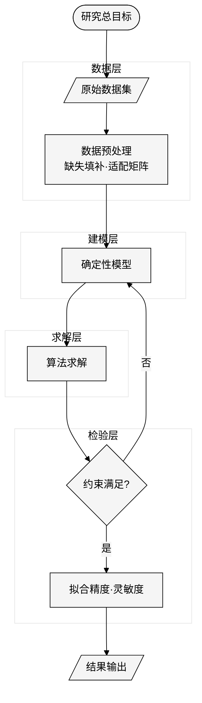
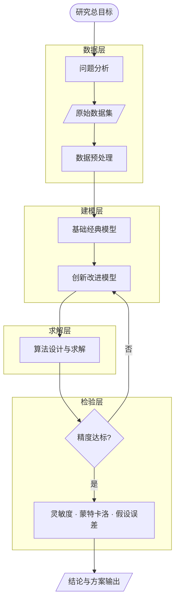
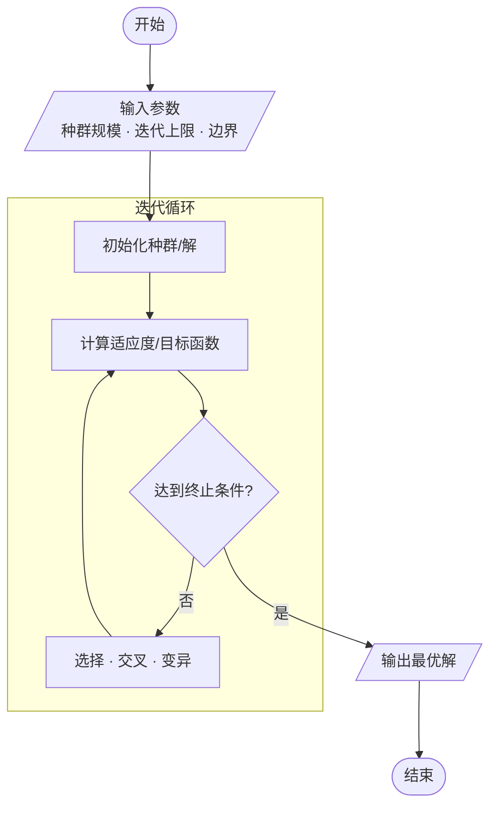
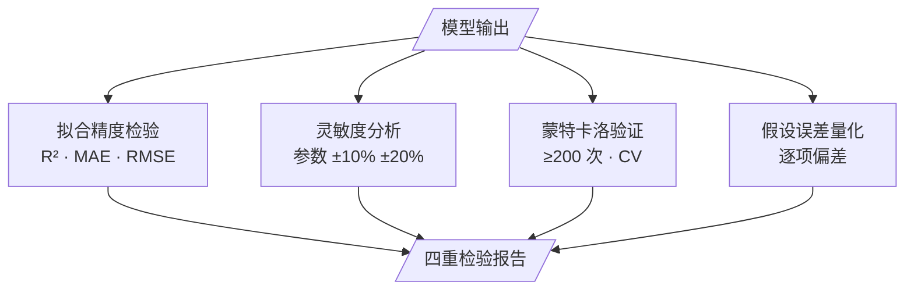

# 流程图排版规范 v1.0 — 国一/特等奖标准

> **定位**：流程图（概念图）的唯一排版标准。**铁律：灰度无彩色**。此前 figure-specs.md 的流程图节点(#404040/#F5F5F5)已是灰度，本文件是完整国一标准的扩展。
> **与数据图分工**：数据图可彩色(5 学术色板)，**流程图一律灰度**——这是国赛评委对流程图的硬性预期，彩色流程图直接降档。
> **引擎**：Mermaid 语法(可复制进 Typora/Obsidian/GitHub) 或 HTML+SVG(diagram-design)，两者都要遵守下面同一套符号/布局/灰度规范。

---

## 一、全局硬性规范

- **灰度**：纯白底 + 纯黑线条，仅浅灰辅助线(#d0d0d0)区分层级。禁止彩色、渐变、花哨背景
- **字号**：Times New Roman + 宋体，8–10pt，与正文匹配；节点内文字不得换行拥挤
- **图宽**：单图 ≤14cm（适配正文页边距），超长分左右两栏，严禁溢出/重叠
- **导出**：矢量(emf/SVG/PDF)，禁止低清 jpg/png

## 二、图形符号标准（不可自创形状）

| 图形 | 用途 |
|------|------|
| 矩形 | 计算模块、算法步骤、模型构建、数据处理 |
| 圆角矩形 | 起始框、结束框、研究总目标、问题总述 |
| 菱形 | 判断条件、约束检验、可行性验证、阈值判断 |
| 平行四边形 | 数据输入、原始数据集、输出结果、仿真数据 |
| 椭圆 | 辅助参数、边界条件、已知常量（少量） |

**禁忌**：不用圆形/五角星/云朵/卡通；菱形分支必须标「是/否」，空白分支扣分；禁止双向箭头。

## 三、布局逻辑（解决重叠/杂乱的方案）

- **单向流向**：自上而下、从左到右；整体层级 = 题目分析→数据处理→模型建立→算法求解→检验分析→结论输出
- **分层分区**：总流程图只展示一级大模块，细分步骤单独做子流程图
- **留白**：横向间距 ≥0.8cm、纵向 ≥1cm；节点内文字左右留边距
- **循环单独分区**：灵敏度/迭代求解(蒙特卡洛/遗传算法循环)用虚线矩形单独圈出
- **杜绝交叉**：多分支用「总线分流」，拐弯全部直角，禁止斜向乱穿

## 四、文字规范

- 学术化表述，拒绝口语（❌"跑一下算法" ✅"采用遗传算法求解目标函数"）
- 单节点 ≤15 字，过长拆两节点
- 公式统一 Times New Roman，与正文一致
- 全文术语统一（不可一处"约束条件"一处"限制条件"）

## 五、高分加分细节

- **模块分区**：浅灰虚线框划分「数据层/建模层/求解层/检验层」，分区标小标题
- **创新点标注**：创新算法/自建模型模块加标记，图注说明「★代表本文创新改进模块」
- **配套说明**：图下补 1–2 行简述核心逻辑，与正文呼应
- **多图统一**：全文所有流程图线条/字体/尺寸完全统一

## 六、高频扣分坑

文字拥挤溢出、彩色流程图、箭头交叉、无分支标注、超出页边距、图注缺失、单图塞全步骤不分总/子图、自创形状、分辨率过低。

## 七、ClaudeCode 绘图强制要求

- Mermaid 语法输出完整可复制代码；严格灰度无彩色；自动控节点间距、拆长文本、杜绝重叠
- 复杂模型自动拆「总流程图 + 子流程图」两张
- 输出附带图注、编号
- 线条直角走向、无交叉、循环模块虚线框标注

---

## Mermaid 灰度模板（直接套用）

**符号对照 Mermaid 语法**：矩形 `[ ]` / 圆角矩形 `( )` / 菱形 `{ }` / 平行四边形 `[/ /]` / 椭圆 `([ ])`。

---

## 八、题型→流程图模板映射（4 类，触发词即出对应灰度流程图）

> 每个模板是通用骨架，Agent 触发时把 `[]`/`()` 里的占位文字替换成题目具体内容，灰度 theme 头统一套用（见 §七模板顶部 `%%{init...}%%`）。

### 模板 1：技术路线图（全局总图，所有题型必备）

**触发词**：技术路线 / 整体流程 / 求解路线 / 建模框架
**结构**：问题分析 → 数据 → 模型 → 求解 → 检验 → 结论

### 模板 2：算法流程图（含迭代循环，B 优化 / D 预测）

**触发词**：算法流程 / 迭代求解 / 优化流程 / 收敛过程
**结构**：初始化 → 迭代 → 判断收敛 → 输出，**循环用 `subgraph` 虚线框圈出**

### 模板 3：数据流水线图（数据预处理，D 数据 / 所有题型数据环节）

**触发词**：数据处理 / 预处理 / 清洗 / EDA / 异常检测
**结构**：原始 → 缺失 → 异常 → 标准化 → 输出（单向链式，无分支）

### 模板 4：四重检验图（检验体系，所有题型 §6 必备）

**触发词**：检验 / 验证 / 四重检验 / 模型检验
**结构**：模型输出 → 拟合精度 / 灵敏度 / 蒙特卡洛 / 假设误差 四路并行 → 报告

**选型规则**：全局总图用模板 1；涉及算法迭代的章节补模板 2；有数据预处理补模板 3；§6 检验必出模板 4。一张总图 + 按需子图，不塞一张。
